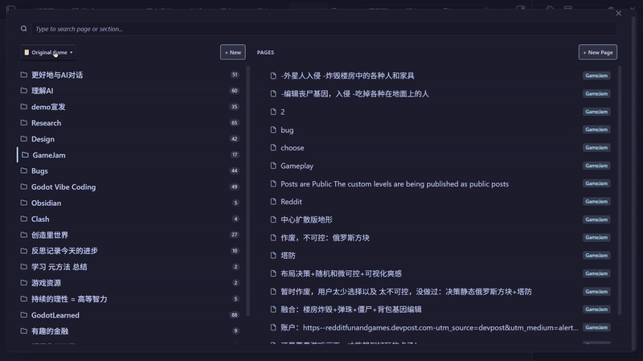
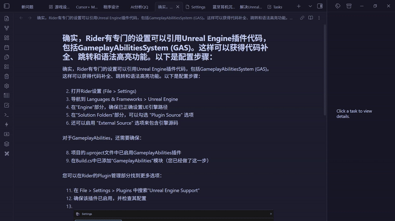
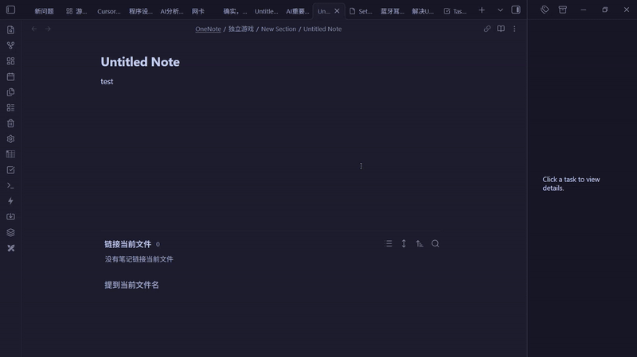
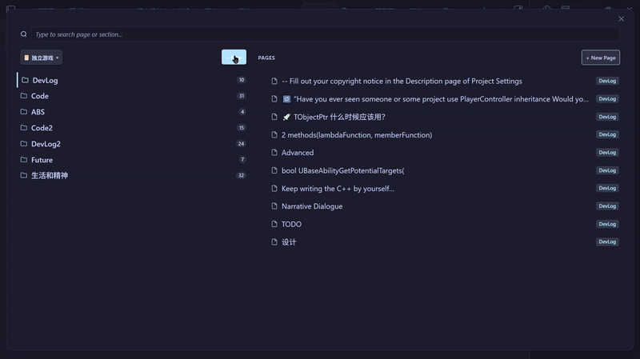
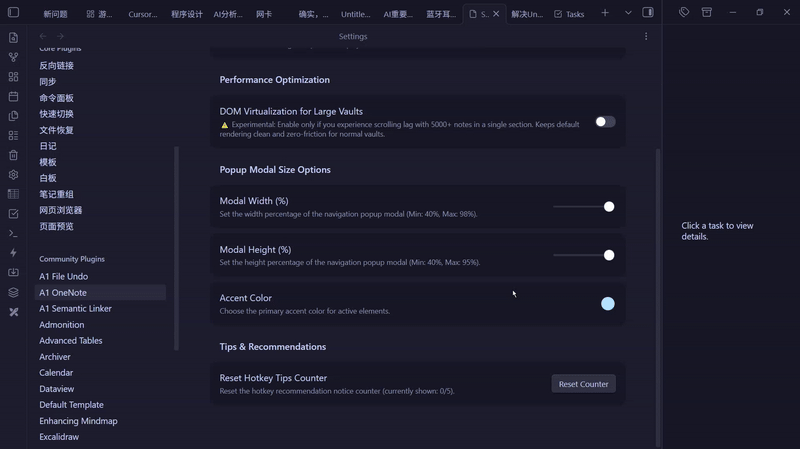
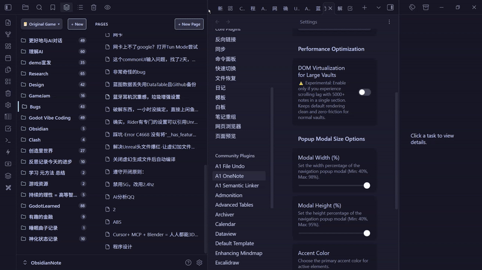

# Fluent OneNote

A beautiful, ultra-fast 2-pane navigation plugin for Obsidian notes, inspired by Microsoft OneNote and Fluent Design principles.

> [!NOTE]
> If you are looking for a local alternative to **Microsoft OneNote**, **Evernote**, **UpNote**, **Bear**, or **Joplin** directly inside your Obsidian vault, Fluent OneNote brings a familiar, high-performance 2-pane navigation system across Notebooks, Sections, and Pages.

---

## Quick Setup & Recommended Workflow

### 1. Assign a Global Hotkey (Highly Recommended)
Fluent OneNote is designed around an instant, distraction-free popup workflow.

1. Open **Obsidian Settings** -> **Hotkeys**.
2. Search for **`Fluent OneNote: Open navigation popup`**.
3. Assign your preferred shortcut (e.g. `Ctrl + Shift + O`, `Alt + O`, or `Ctrl + Shift + A`).

Whenever you need to switch notes or capture a thought, press your hotkey, browse or search across sections, and press `Enter` to jump right into the note without leaving your typing flow.

---

## Key Features

### 1. 2-Pane Navigation Architecture

- **Sections Column (Left)**: Displays section folders under the active Notebook as clean cards with note counters. The header features a sleek OneNote-style Notebook Selector dropdown.
- **Pages Column (Right)**: Displays all notes and nested sub-pages belonging to the selected section.
- **Cross-Pane Focus**: Seamlessly jump focus between sections and pages with arrow keys or mouse clicks.

### 2. Floating Popup & Fast Keyboard Navigation

- Access your entire notebook hierarchy from anywhere in Obsidian.
- Instant keyboard navigation with arrow keys, quick selection, and background tab opening.

### 3. Instant Search-as-you-Type with Full IME Support & Global Scope Toggle

- **Instant Focus & Zero Lag**: The search input receives instant focus on modal open.
- **Full IME Compatibility**: Complete support for Chinese, Japanese, and Korean IMEs (e.g., WeChat Keyboard / 微信输入法, Microsoft Pinyin, Sogou Pinyin) from the very first keystroke without dropped composition or popup delays.
- **Global vs Scoped Search Scope Toggle**:
  - **Single Notebook Search (`📓 Current`)**: Default search strictly scoped to the active notebook with dynamic placeholder (`Search in "<Notebook>"...`), showing section badges.
  - **Global Vault Search (`🌐 All`)**: Instant one-click toggle in the search bar header to search across all notebooks and recursive sub-page hierarchies simultaneously, displaying full path badges (`Notebook / Section`).
- **In-Box Navigation**: Navigate search results with `ArrowUp` / `ArrowDown` while remaining in the search box; press `Enter` to open.

### 4. Physics Drag & Drop & Uniform rAF Auto-Scroll

- **High-Performance Physics Engine**: Reorder Notebooks, Sections, and Pages with 0ms visual latency and zero reactivity lag.
- **Uniform rAF Auto-Scroll**: Generous 60px linear-damping edge auto-scroller allows smooth list scrolling while dragging items.
- **Anti-Flicker Protection**: Child elements are shielded during drag to eliminate mouse coordinate jitter and indicator ghosts.
- **Cross-Pane Moves**: Drag any Page onto a Section or Notebook folder card to move the note into that directory.

### 5. Custom Order Management (Export, Import & Reset)
- **Export Order**: Export your custom drag-and-drop notebook, section, and page arrangement to a standalone `.json` file via the native file save dialog.
- **Import Order**: Import a previously exported `.json` configuration to restore custom orderings across devices.
- **Clear Order**: Reset all custom orderings back to default alphabetical order with a confirmation warning dialog.

### 6. Folder-Note Sub-Page Hierarchy
- Supports multi-level nested sub-pages with collapsible chevrons (`> / ∨`).
- When a folder and a markdown note share the same name within a section, they automatically fuse into a parent "Folder-Note".
- Safe deletion un-nests child notes to the parent section, protecting nested notes from accidental data loss.

### 7. Recent Pages Quick Switcher
- Dedicated command (`Fluent OneNote: Open recent pages list`) to quickly access your most recently opened notes with timestamps.

### 8. Customizable Dimensions & Theme Accent Colors

- Customize the popup modal width (40%–98%) and height (40%–95%) to fit your screen size.
- Pick a custom accent color to harmonize with your Obsidian theme.

### 9. Dual Display Modes

- Choose between **Floating popup only** or **Both (sidebar + floating popup)** in plugin settings depending on your layout preference.

---

## Keyboard Controls Cheatsheet

| Action | Shortcut / Interaction | Description |
| :--- | :--- | :--- |
| **Open Navigation Popup** | Custom Hotkey (`Ctrl+Shift+O`) | Open floating 2-pane navigation modal |
| **Open Sidebar View** | Command: `Open navigation sidebar` | Open persistent sidebar tab view |
| **Open Recent Pages** | Command: `Open recent pages list` | Open recent notes fuzzy switcher |
| **Navigate Items** | `ArrowUp` / `ArrowDown` | Move selection vertically in active pane |
| **Jump to Pages Pane** | `ArrowRight` (on Section) | Shift active focus into the Pages column |
| **Return to Section Pane** | `ArrowLeft` (on Page) | Shift active focus back to the Section row |
| **Toggle Sub-pages / Expand** | `ArrowRight` / `ArrowLeft` | Expand or collapse nested sub-pages |
| **Open Note & Dismiss** | `Enter` / `Space` | Open note in active editor and close popup |
| **Open in Background Tab** | `Middle-Click` / `Ctrl+Click` / `Ctrl+Enter` | Open in new tab without closing popup |
| **Open Feature Guide** | Click `(?)` button in header | Open full interactive features & shortcuts guide |
| **Create New Note** | `Ctrl + N` (or `+ New Page` button) | Create a new note inside active section |
| **Search Notes** | Type any key | Search across all notes with instant IME support |
| **Clear Search / Close** | `Escape` | First press clears query; second press closes modal |
| **Delete Note Safely** | `Delete` / `Backspace` (on Page) | Move note to trash with sub-page protection |
| **Context Menu** | `Right-Click` on any item | Native actions (Rename, Delete, Create Section/Note) |

---

## Configuration Options

Go to **Obsidian Settings** -> **Community Plugins** -> **Fluent OneNote**:

- **Root Folder Path**: The root vault folder containing your notebooks (default: `OneNote`). Leave blank to scan your entire vault.
- **Display Mode**: Toggle between `Floating popup only` and `Both (sidebar + floating popup)`.
- **Global Search by Default**: Toggle whether the search popup defaults to searching across all notebooks or only the current notebook.
- **DOM Virtualization**: Optional viewport optimization for sections containing large numbers of notes.
- **Popup Modal Width / Height**: Adjust the width (40%–98%) and height (40%–95%) of the popup modal.
- **Accent Color**: Pick a custom accent color for focus highlights and active badges.
- **Custom Order Management**:
  - **Export Custom Order**: Save custom ordering to a `.json` file.
  - **Import Custom Order**: Restore ordering from a `.json` file.
  - **Clear Custom Order**: Revert all orderings to alphabetical sort (includes confirmation dialog).
- **Reset Hotkey Tips Counter**: Reset the recommendation notice counter.

---

## License

This project is licensed under the [MIT License](LICENSE).

---

###### Keywords
`onenote` `onenote alternative` `evernote` `upnote` `bear` `joplin` `notebook navigation` `2-pane view` `sections and pages` `subpages` `fluent design` `quick switcher` `hotkey navigation` `physics drag and drop`
